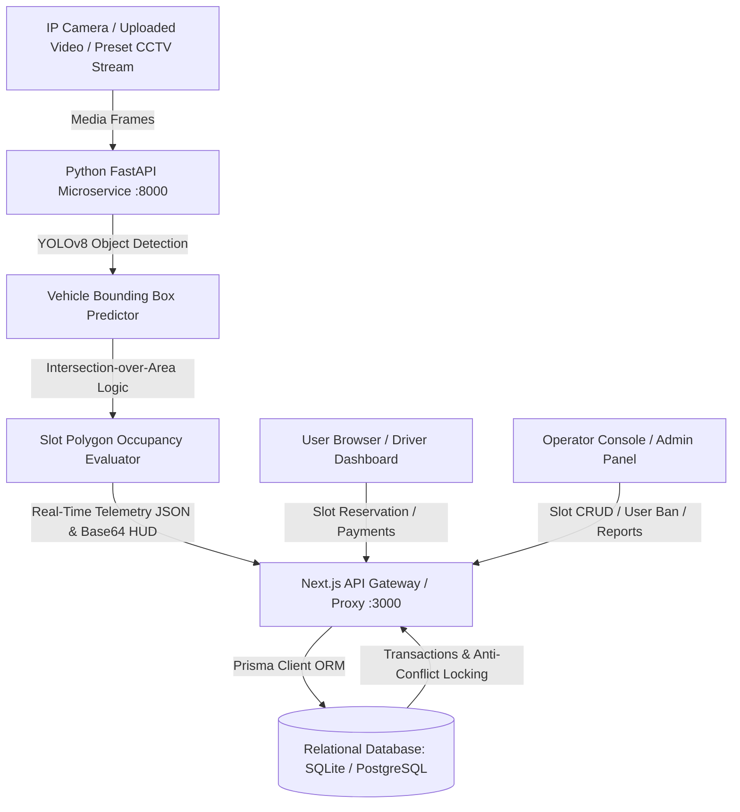

# 🚗 AI-Powered Smart Parking Management System

> **A Complete Full-Stack & Computer Vision Solution for Intelligent Parking Optimization**  
> *Final-Year Engineering Project (Computer Science / AI & ML / Full-Stack Development)*

---

## 🌟 Executive Summary

The **AI Smart Parking Management System** is a next-generation parking reservation and automated computer-vision monitoring application. Combining **Next.js 15+ App Router**, **TypeScript**, **PostgreSQL / SQLite with Prisma ORM**, and a **Python FastAPI YOLOv8 + OpenCV AI Microservice**, this system bridges real-world computer vision camera analytics with real-time web reservation workflows without requiring expensive physical sensor hardware.

---

## 🏗️ System Architecture



---

## ⚡ Key Highlights & Core Features

### 🧠 1. AI-Driven Computer Vision & Zero-Hardware Simulation
- **YOLOv8 Vehicle Detection**: Automated detection of vehicles (cars, motorcycles, EV vans) from surveillance feeds.
- **Slot Polygon Intersection-over-Area (IoA)**: Computes IoA between vehicle bounding boxes and predetermined parking bays.
- **Smart Fallback Engine**: Seamlessly transitions to adaptive edge/contour computer vision if neural network weights are loading.
- **Live HUD Video Stream Overlay**: Semi-transparent green (available), red (occupied), and yellow (reserved) polygon overlays with camera telemetry.
- **Preset Camera Feeds & Upload Custom Media**: Test live traffic conditions, light parking, and rush hour scenarios, or upload custom surveillance images/videos.

### 👤 2. User & Driver Experience
- **Interactive Multi-Floor Slot Map**: Visual grid of all slots across Ground Floor, Floor 1, and Floor 2 with live status indicators.
- **Anti-Conflict Booking Engine**: Atomic database transactions that prevent double-booking conflicts across overlapping time intervals.
- **Custom Reservation Durations**: Reserve slots for 1, 2, 4, or 8 hours with automatic fee calculation.
- **Printable Booking Vouchers**: Download or print digital parking receipts featuring unique voucher codes and entry QR instructions.
- **Profile & Vehicle Management**: Manage registered plate numbers, phone numbers, and update account passwords.

### 🛡️ 3. Operator & Administrative Control Center
- **Executive Operations Dashboard**: KPI cards tracking Total Drivers, Slot Capacity, Live Occupancy Rate, and Daily Revenue.
- **Interactive Recharts Visualizations**: Donut occupancy breakdowns, 7-day revenue bar charts, and daily demand volume curves.
- **Full Slot CRUD Management**: Dynamically add new parking slots, edit hourly tariffs, and toggle slots to maintenance mode.
- **User Account Oversight**: Search driver profiles, view customer booking counts, and suspend/activate accounts.
- **Audit Logs & Status Management**: Mark active bookings as completed or inspect historical reservations.
- **Aggregated Analytics & CSV Export**: Peak parking demand analysis, top-performing slot rankings, and one-click operational CSV report generation.
- **Facility Configuration**: Modify default hourly rates, operating hours, and YOLO AI confidence thresholds.

---

## 🛠️ Technology Stack

| Layer | Technologies Used |
|---|---|
| **Frontend Framework** | Next.js 15+ (App Router), React 19, TypeScript |
| **Styling & UI** | Tailwind CSS, Lucide React Icons, Custom Component System |
| **Data Visualization** | Recharts (Responsive Donut, Bar, and Line charts) |
| **Backend & APIs** | Next.js Route Handlers (REST), JWT Authentication with HTTP-Only Cookies |
| **ORM & Database** | Prisma ORM 5.22, SQLite (zero-config local) / PostgreSQL ready |
| **AI Microservice** | Python 3.10+, FastAPI, Uvicorn, YOLOv8 (Ultralytics), OpenCV (cv2), NumPy |

---

## 🔑 Demo Access Credentials

The database comes pre-seeded with accounts for quick testing and evaluation:

| Role | Email | Password | Access Capabilities |
|---|---|---|---|
| **Facility Operator (Admin)** | `operator@aiparking.com` | `Operator@123` | Full control: slots CRUD, live analytics, user management, CSV exports, settings |
| **Standard User (Driver)** | `john@example.com` | `User@123` | Live slot map, slot reservation, receipt printing, booking history, profile |

> **Note**: The login screen also contains **1-Click Quick Demo Login** buttons for instant access without manual typing.

---

## 🚀 Getting Started & Installation Guide

### Prerequisites
- **Node.js**: v18.18+ or v20+
- **Python**: v3.10+ (for the AI Microservice)
- **Git**

---

### Step 1: Clone the Repository
```bash
git clone <repository-url>
cd ai-smart-parking
```

---

### Step 2: Set Up the AI Computer Vision Microservice (FastAPI)
```bash
# Navigate to AI microservice
cd ai-service

# Create and activate Python virtual environment
python -m venv venv

# Windows:
.\venv\Scripts\activate
# Linux/macOS:
# source venv/bin/activate

# Install dependencies
pip install -r requirements.txt

# Start the FastAPI server on port 8000
python app.py
```
> The AI service will be live at `http://localhost:8000`. You can inspect the interactive OpenAPI documentation at `http://localhost:8000/docs`.

---

### Step 3: Set Up the Full-Stack Next.js Frontend & API
```bash
# In a new terminal window, navigate to the frontend directory
cd frontend

# Install Node dependencies
npm install

# Generate Prisma Client & initialize SQLite database
npx prisma db push

# Seed the database with demo users, 24 multi-floor slots, and bookings
npx prisma db seed

# Start Next.js Development Server
npm run dev
```
> Open your browser and navigate to **`http://localhost:3000`**.

---

## 📖 Complete Application Pages & Routes

| Route | Name | Target User | Description |
|---|---|---|---|
| `/` | Landing Page | Public | Hero showcase, key features, architecture overview, and CTA buttons. |
| `/login` | Login Page | Public | Role-based authentication with 1-click demo login shortcuts. |
| `/register` | Registration | Public | Driver sign-up with vehicle plate number auto-registration. |
| `/dashboard` | User Dashboard | User | Live slot occupancy summary, active reservation timer, and quick links. |
| `/live-parking` | Live AI Camera | Both | Real-time YOLOv8 video feed, slot polygon HUD, and telemetry stats. |
| `/book-slot` | Book Parking Slot | User | Interactive slot selector with conflict-free reservation checkout. |
| `/booking-history` | Booking History | User | Filterable table with cancellation and printable voucher modals. |
| `/profile` | Profile & Security | User | Personal details, default vehicle number, and password updater. |
| `/operator/dashboard` | Operator Dashboard | Operator | Real-time KPIs, Recharts charts, AI telemetry, and recent reservations. |
| `/operator/slots` | Slots Management | Operator | Multi-floor slot CRUD (Add/Edit/Delete) with active booking protection. |
| `/operator/users` | Users Console | Operator | Driver directory, booking counts, and account suspension toggle. |
| `/operator/bookings` | All Bookings | Operator | Complete reservation audit log with manual status completion. |
| `/operator/reports` | Reports & Export | Operator | Peak parking hours, most popular slots, and CSV export. |
| `/operator/settings` | System Settings | Operator | Facility tariffs, active floors, buffer minutes, and AI confidence slider. |

---

## 🧪 Testing & Verification

1. **Verify Web Production Build**:
   ```bash
   cd frontend
   npm run build
   ```
   *Result: 18 static and dynamic routes compiled with 0 TypeScript/Webpack errors.*

2. **Verify AI Microservice**:
   ```bash
   curl http://localhost:8000/status
   ```
   *Expected Response:*
   ```json
   {
     "status": "ready",
     "model": "yolov8n.pt",
     "confidence_threshold": 0.25,
     "default_slots_count": 8
   }
   ```

---

## 🎓 College Project Presentation Checklist

When presenting this project for evaluation, highlight the following key engineering decisions:
1. **Separation of Concerns**: Microservice architecture isolating compute-heavy AI/Computer Vision (Python) from responsive web application routing (Next.js/TypeScript).
2. **Relational Integrity**: Prisma ORM schema with foreign key constraints, indexes, and anti-conflict booking window validations.
3. **Responsive UI/UX**: Handcrafted Tailwind design system adhering to modern accessibility and clean telemetry visualization guidelines.
4. **Hardware-Free Simulation**: Ability to test end-to-end edge AI scenarios using uploaded surveillance footage and preset sample camera scenes.

---

## 📄 License
This project is open-source and available under the [MIT License](LICENSE).
